# Pivot Care AI

## 1. Project Overview

**Pivot Care AI** is an **AI-powered customer support SaaS platform** that enables organizations to embed a chat widget on their websites. The widget automatically handles customer conversations using an AI agent (OpenAI), with the ability to **escalate to human operators** when needed. Organization operators manage conversations through a dedicated dashboard.

### Core Value Proposition

| Capability | Description |
|---|---|
| 🤖 AI-First Support | Automated customer support powered by OpenAI GPT-4o |
| 💬 Embeddable Widget | Drop-in chat widget with multi-screen flow (auth → inbox → chat → voice) |
| 📊 Operator Dashboard | Real-time conversation management with status filtering & AI-enhanced replies |
| 🔄 Smart Escalation | AI auto-escalates to humans on frustration detection; auto-resolves on closure |
| 🎙️ Voice Support | VAPI-powered voice call integration in the widget |
| 🏢 Multi-Tenant | Organization-scoped data isolation via Clerk organizations |

---

## 2. Tech Stack

| Layer | Technology | Purpose |
|---|---|---|
| **Monorepo** | pnpm workspaces + Turborepo | Build orchestration & dependency management |
| **Frontend Framework** | Next.js 16 (App Router) | SSR, routing, React Server Components |
| **UI Components** | shadcn/ui + Radix UI + Tailwind CSS 4 | Design system & accessible components |
| **State Management** | Jotai | Atomic client-side state |
| **Backend** | Convex | Real-time serverless database & functions |
| **AI Agent** | `@convex-dev/agent` + OpenAI GPT-4o | Conversational AI with tool use |
| **AI SDK** | Vercel AI SDK (`ai` package) | Text generation for message enhancement |
| **Authentication** | Clerk | Multi-tenant auth with organization support |
| **Voice** | VAPI (`@vapi-ai/web`) | Real-time voice calls in widget |
| **Error Tracking** | Sentry | Client & server error monitoring |
| **Forms** | React Hook Form + Zod | Form management & validation |
| **Charts** | Recharts | Dashboard data visualization |

---

## 3. Monorepo Architecture

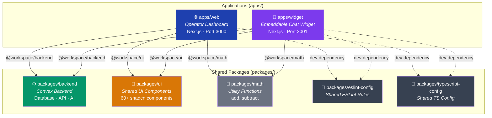

### Package Summary

| Package | Name | Description |
|---|---|---|
| `apps/web` | `web` | Operator dashboard — Clerk-authenticated, Next.js app with conversation management |
| `apps/widget` | `widget` | Customer-facing embeddable chat widget — session-based auth, multi-screen flow |
| `packages/backend` | `@workspace/backend` | Convex backend — schema, queries, mutations, actions, AI agent |
| `packages/ui` | `@workspace/ui` | 60+ shared shadcn/ui components (button, dialog, sidebar, chart, etc.) |
| `packages/math` | `@workspace/math` | Simple math utility (add/subtract) — likely a monorepo template remnant |
| `packages/eslint-config` | `@workspace/eslint-config` | Shared ESLint configuration |
| `packages/typescript-config` | `@workspace/typescript-config` | Shared TypeScript configuration |

---

## 4. High-Level System Architecture

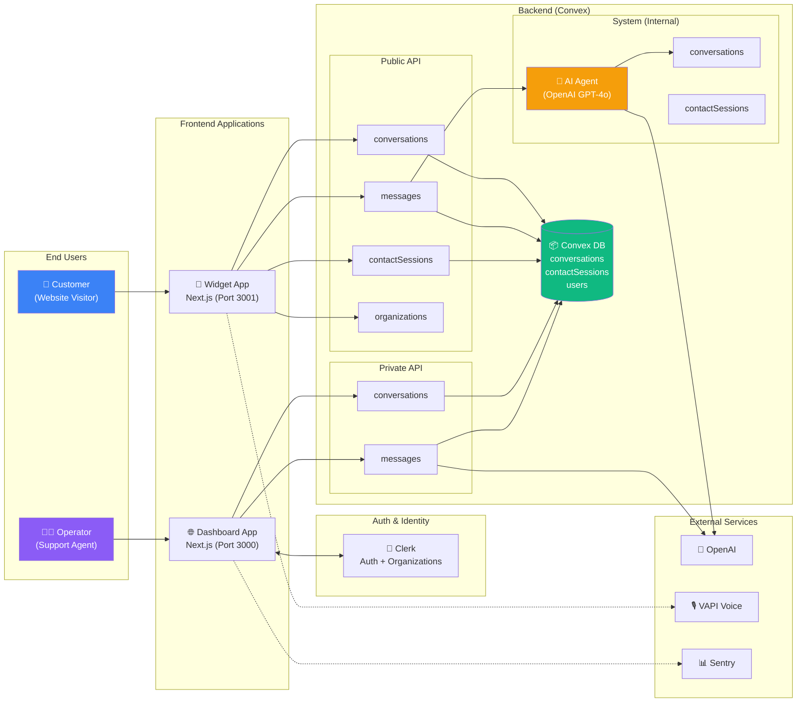

---

## 5. Database Schema (ERD)

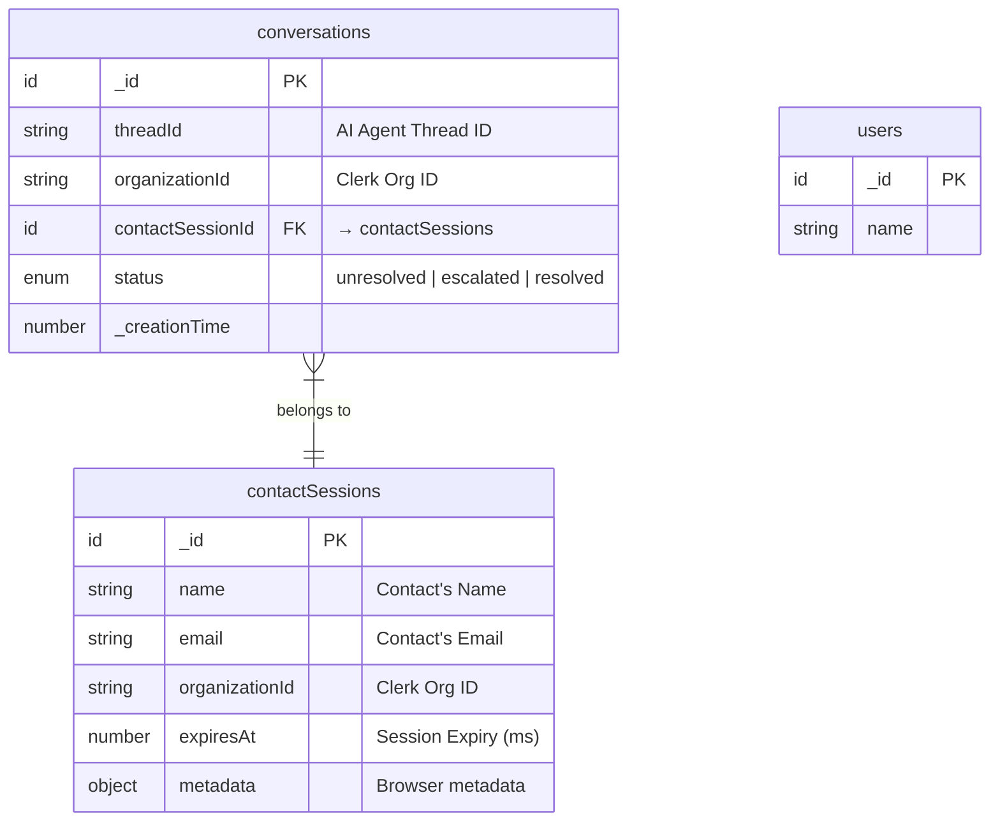

### Indexes

| Table | Index | Fields | Purpose |
|---|---|---|---|
| `conversations` | `by_organization_id` | `organizationId` | Filter by org in dashboard |
| `conversations` | `by_contact_session_id` | `contactSessionId` | Widget conversation lookup |
| `conversations` | `by_thread_id` | `threadId` | AI thread → conversation mapping |
| `conversations` | `by_status_and_organization_id` | `status`, `organizationId` | Filtered dashboard queries |
| `contactSessions` | `by_organization_id` | `organizationId` | Org-scoped session lookup |
| `contactSessions` | `by_expires_at` | `expiresAt` | Session cleanup |

### Contact Session Metadata Schema

The `contactSessions.metadata` captures browser telemetry:
- `userAgent`, `language`, `languages`, `platform`, `vendor`
- `screenResolution`, `viewportSize`
- `timezone`, `timezoneOffset`
- `cookiesEnabled`, `referrer`, `currentUrl`

---

## 6. Convex API Layer Architecture

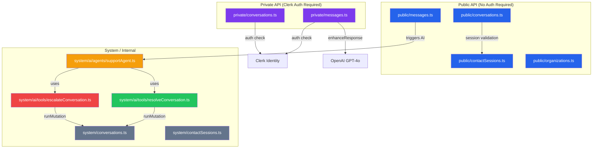

### API Endpoints Summary

#### Public API (Widget — session-based auth via `contactSessionId`)

| File | Function | Type | Description |
|---|---|---|---|
| `contactSessions.ts` | `create` | mutation | Create a 24h session with browser metadata |
| `contactSessions.ts` | `validate` | mutation | Check if session is valid and not expired |
| `conversations.ts` | `getMany` | query | List conversations for a contact session (paginated, with last message) |
| `conversations.ts` | `getOne` | query | Get single conversation details |
| `conversations.ts` | `create` | mutation | Create conversation + AI thread + initial greeting |
| `messages.ts` | `create` | action | Send message → triggers AI agent (if unresolved) or saves raw (if escalated) |
| `messages.ts` | `getMany` | query | List messages in a thread (paginated) |
| `organizations.ts` | `validate` | action | Verify org exists via Clerk API |

#### Private API (Dashboard — Clerk JWT auth)

| File | Function | Type | Description |
|---|---|---|---|
| `conversations.ts` | `getMany` | query | List org conversations with status filter + contact info + last message |
| `conversations.ts` | `getOne` | query | Get conversation with contact session details |
| `conversations.ts` | `updateStatus` | mutation | Change conversation status (unresolved/escalated/resolved) |
| `messages.ts` | `getMany` | query | List messages for a conversation thread |
| `messages.ts` | `create` | mutation | Operator sends a message (saved as assistant role) |
| `messages.ts` | `enhanceResponse` | action | AI-enhance operator's draft message for professionalism |

#### System / Internal API

| File | Function | Type | Description |
|---|---|---|---|
| `conversations.ts` | `escalate` | internalMutation | Set conversation status to "escalated" |
| `conversations.ts` | `resolve` | internalMutation | Set conversation status to "resolved" |
| `conversations.ts` | `getByThreadId` | internalQuery | Lookup conversation by AI thread ID |
| `contactSessions.ts` | `getOne` | internalQuery | Fetch a contact session by ID |

---

## 7. AI Agent System

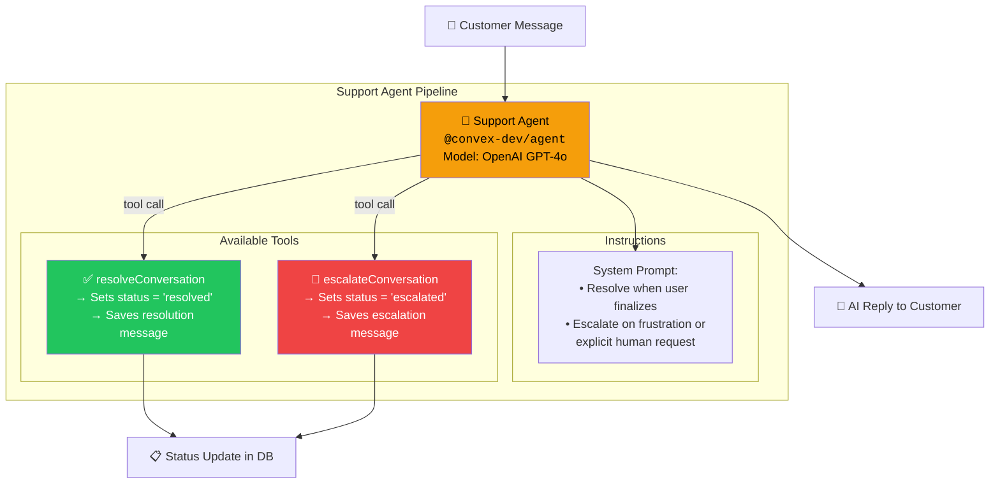

### How it works

1. Customer sends a message via the widget → `public/messages.create` action
2. If conversation is **unresolved**: triggers `supportAgent.generateText()` with the user's prompt and both tools
3. The AI agent (OpenAI GPT-4o) processes the message and decides to:
   - **Reply normally** — generates a helpful response
   - **Resolve** — calls `resolveConversation` tool → sets status to `resolved` + saves confirmation
   - **Escalate** — calls `escalateConversation` tool → sets status to `escalated` + saves notification
4. If conversation is **escalated**: the message is saved without triggering AI (human operator takes over)
5. Operators can use `enhanceResponse` to AI-polish their draft replies before sending

### Message Enhancement Flow (Operator)

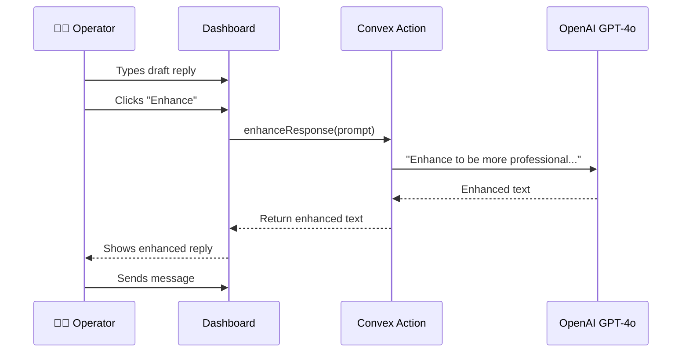

---

## 8. Authentication Architecture

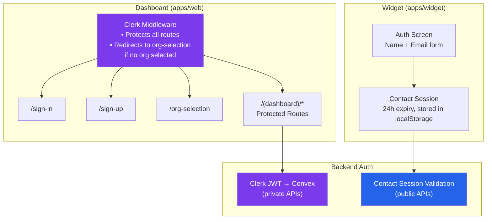

### Two Auth Models

| Model | Used By | Mechanism | Duration |
|---|---|---|---|
| **Clerk JWT** | Dashboard (`apps/web`) | Clerk middleware → `auth.protect()` → org-scoped identity | Browser session |
| **Contact Session** | Widget (`apps/widget`) | `contactSessions.create` → ID stored in localStorage | 24 hours |

### Dashboard Middleware Rules

- **Public routes**: `/sign-in`, `/sign-up` — no auth required
- **Org-free routes**: `/sign-in`, `/sign-up`, `/org-selection` — no org required
- **All other routes**: require authentication + organization selection
- Missing org → redirect to `/org-selection`

---

## 9. Widget State Machine

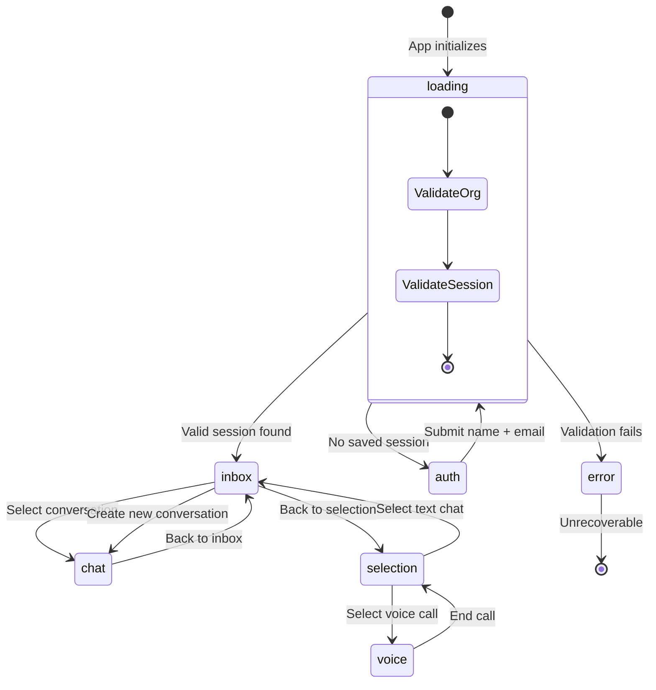

### Widget Screens

| Screen | Key | Description |
|---|---|---|
| `loading` | `LOADING` | Validates organization ID + contact session |
| `error` | `ERROR` | Displays error message for invalid org or session |
| `auth` | `AUTH` | Name + email form to create contact session |
| `selection` | `SELECTION` | Choose between text chat and voice call |
| `inbox` | `INBOX` | List of conversations for the current contact session |
| `chat` | `CHAT` | Real-time chat interface with AI or human operator |
| `voice` | `VOICE` | VAPI-powered voice call interface |
| `contact` | `CONTACT` | Contact information screen |

### Widget State Atoms (Jotai)

| Atom | Type | Description |
|---|---|---|
| `screenAtom` | `WidgetScreen` | Current visible screen |
| `organizationIdAtom` | `string \| null` | Org ID from URL search params |
| `contactSessionIdAtomFamily` | `Id \| null` | Per-org session ID in localStorage |
| `errorMessageAtom` | `string \| null` | Error message for error screen |
| `loadingMessageAtom` | `string \| null` | Loading text indicator |
| `conversationIdAtom` | `Id \| null` | Currently selected conversation |

---

## 10. Dashboard Module Structure

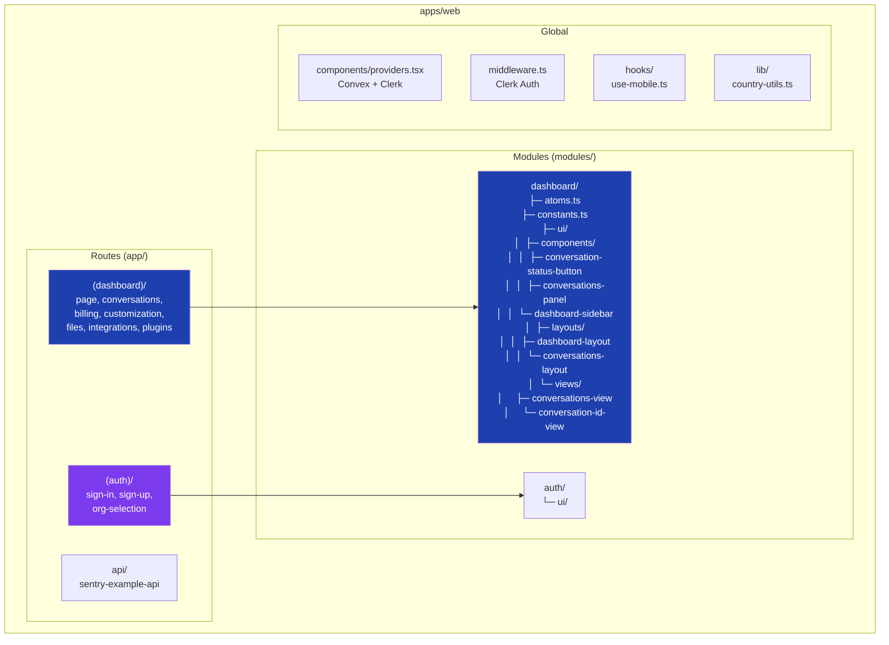

### Dashboard Route Map

| Route | Description |
|---|---|
| `/sign-in` | Clerk sign-in page |
| `/sign-up` | Clerk sign-up page |
| `/org-selection` | Organization picker |
| `/` | Dashboard home (basic page with user info) |
| `/conversations` | Conversations list with status filtering |
| `/conversations/[conversationId]` | Individual conversation thread view |
| `/billing` | Billing management (planned) |
| `/customization` | Widget customization (planned) |
| `/files` | File management (planned) |
| `/integrations` | Third-party integrations (planned) |
| `/plugins` | Plugin management (planned) |

---

## 11. Request Flow Diagrams

### Customer Chat Flow (Widget → AI)

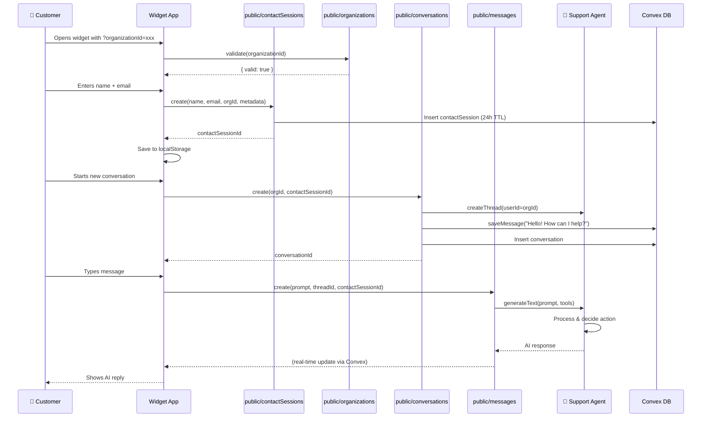

### Operator Reply Flow (Dashboard)

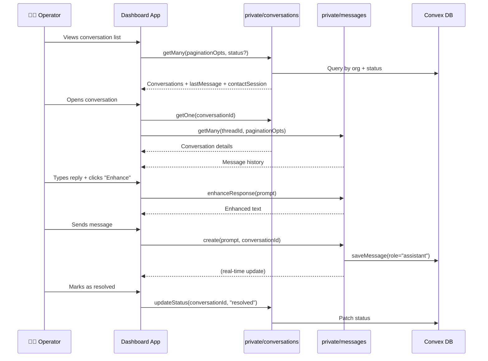

---

## 12. Environment Variables

### `apps/web` (.env)

| Variable | Description |
|---|---|
| `NEXT_PUBLIC_CONVEX_URL` | Convex deployment URL |
| `NEXT_PUBLIC_CLERK_PUBLISHABLE_KEY` | Clerk public key |
| `CLERK_SECRET_KEY` | Clerk server-side key |
| `NEXT_PUBLIC_CLERK_SIGN_IN_URL` | Sign-in route (`/sign-in`) |
| `NEXT_PUBLIC_CLERK_SIGN_UP_URL` | Sign-up route (`/sign-up`) |
| `SENTRY_AUTH_TOKEN` | Sentry error tracking token |

### `packages/backend` (.env)

| Variable | Description |
|---|---|
| `CONVEX_DEPLOYMENT` | Convex deployment identifier |
| `CONVEX_URL` | Convex API URL |
| `CLERK_JWT_ISSUER_DOMAIN` | Clerk JWT domain for Convex auth |
| `CLERK_SECRET_KEY` | Clerk secret for org validation |
| `OPENAI_API_KEY` | OpenAI API key for AI agent |

### `apps/widget` (.env)

| Variable | Description |
|---|---|
| `NEXT_PUBLIC_CONVEX_URL` | Convex deployment URL |

---

## 13. Shared UI Package

The `packages/ui` contains **60+ shadcn/ui components** built on Radix UI primitives with Tailwind CSS. Key components include:

| Category | Components |
|---|---|
| **Layout** | `sidebar`, `resizable`, `card`, `separator`, `aspect-ratio`, `scroll-area` |
| **Navigation** | `breadcrumb`, `navigation-menu`, `menubar`, `tabs`, `pagination` |
| **Forms** | `input`, `textarea`, `select`, `checkbox`, `radio-group`, `switch`, `slider`, `form`, `field`, `combobox`, `calendar`, `input-otp` |
| **Overlays** | `dialog`, `alert-dialog`, `sheet`, `drawer`, `popover`, `hover-card`, `tooltip`, `dropdown-menu`, `context-menu` |
| **Data Display** | `table`, `badge`, `avatar`, `dicebear-avatar`, `chart`, `accordion`, `carousel`, `progress`, `skeleton` |
| **Feedback** | `alert`, `sonner` (toast), `spinner`, `empty` |
| **Custom** | `conversation-status-icon`, `infinite-scroll-trigger`, `button-group`, `hint`, `kbd`, `direction` |

---

## 14. Conversation Status Lifecycle

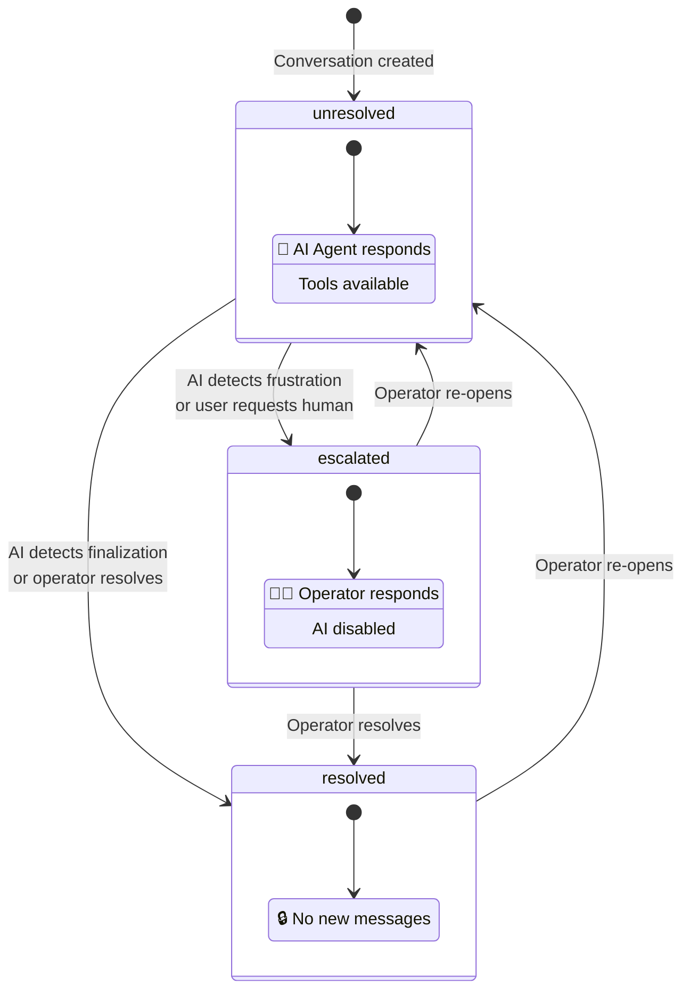

---

## 15. File Tree Summary

```
Pivot Care AI/
├── apps/
│   ├── web/                          # Operator Dashboard (Next.js 16)
│   │   ├── app/
│   │   │   ├── (auth)/               # Auth route group
│   │   │   │   ├── sign-in/
│   │   │   │   ├── sign-up/
│   │   │   │   └── org-selection/
│   │   │   ├── (dashboard)/           # Protected dashboard routes
│   │   │   │   ├── conversations/
│   │   │   │   │   └── [conversationId]/
│   │   │   │   ├── billing/
│   │   │   │   ├── customization/
│   │   │   │   ├── files/
│   │   │   │   ├── integrations/
│   │   │   │   └── plugins/
│   │   │   └── api/
│   │   ├── components/providers.tsx    # Convex + Clerk providers
│   │   ├── middleware.ts              # Clerk auth middleware
│   │   ├── modules/
│   │   │   ├── auth/ui/
│   │   │   └── dashboard/
│   │   │       ├── atoms.ts           # Jotai state (status filter)
│   │   │       ├── constants.ts
│   │   │       └── ui/
│   │   │           ├── components/    # Sidebar, ConversationsPanel, StatusButton
│   │   │           ├── layouts/       # DashboardLayout, ConversationsLayout
│   │   │           └── views/         # ConversationsView, ConversationIdView
│   │   ├── hooks/use-mobile.ts
│   │   └── lib/country-utils.ts
│   │
│   └── widget/                        # Customer Chat Widget (Next.js 16)
│       ├── app/
│       │   ├── layout.tsx
│       │   └── page.tsx               # Entry: reads ?organizationId
│       ├── modules/widget/
│       │   ├── atoms/widget-atoms.ts   # Jotai state (screen, session, etc.)
│       │   ├── constants.ts           # Screen enum, session key
│       │   ├── types.ts               # WidgetScreen type
│       │   ├── hooks/use-vapi.ts      # VAPI voice call hook
│       │   └── ui/
│       │       ├── components/        # WidgetHeader, WidgetFooter
│       │       ├── screens/           # Auth, Chat, Inbox, Selection, Voice, Error, Loading
│       │       └── views/widget-view  # Main widget view controller
│       └── components/providers.tsx    # Convex provider (no Clerk)
│
├── packages/
│   ├── backend/                       # Convex Backend
│   │   └── convex/
│   │       ├── schema.ts             # DB schema (conversations, contactSessions, users)
│   │       ├── auth.config.ts        # Clerk JWT config
│   │       ├── convex.config.ts      # App config + agent plugin
│   │       ├── users.ts              # User CRUD
│   │       ├── public/               # Unauthenticated APIs (widget)
│   │       │   ├── contactSessions.ts
│   │       │   ├── conversations.ts
│   │       │   ├── messages.ts
│   │       │   └── organizations.ts
│   │       ├── private/              # Clerk-authenticated APIs (dashboard)
│   │       │   ├── conversations.ts
│   │       │   └── messages.ts
│   │       └── system/               # Internal-only APIs
│   │           ├── contactSessions.ts
│   │           ├── conversations.ts
│   │           └── ai/
│   │               ├── agents/supportAgent.ts
│   │               └── tools/
│   │                   ├── escalateConversation.ts
│   │                   └── resolveConversation.ts
│   │
│   ├── ui/                            # Shared Component Library
│   │   └── src/components/            # 60+ shadcn/ui components
│   │
│   ├── math/                          # Utility package
│   ├── eslint-config/                 # Shared ESLint
│   └── typescript-config/             # Shared TSConfig
│
├── turbo.json                         # Turborepo pipeline config
├── pnpm-workspace.yaml                # Workspace definitions
└── package.json                       # Root scripts & dev deps
```

---

## 16. Development Commands

| Command | Description |
|---|---|
| `pnpm dev` | Start all apps + backend in parallel (via Turborepo) |
| `pnpm build` | Build all packages and apps |
| `pnpm lint` | Run ESLint across all packages |
| `pnpm format` | Format all files with Prettier |

Individual app commands:
- `apps/web`: `next dev --port 3000`
- `apps/widget`: `next dev --turbopack --port 3001`
- `packages/backend`: `convex dev`

---

## 17. Local Setup Guide

### Prerequisites

Make sure the following are installed on your machine before proceeding:

| Tool | Minimum Version | Check Command | Install |
|---|---|---|---|
| **Node.js** | v20+ | `node -v` | [nodejs.org](https://nodejs.org/) |
| **pnpm** | v10.4+ | `pnpm -v` | `npm install -g pnpm` |
| **Git** | any | `git --version` | [git-scm.com](https://git-scm.com/) |

You will also need accounts on these services (all have free tiers):

| Service | Purpose | Sign Up |
|---|---|---|
| **Clerk** | Authentication & organization management | [clerk.com](https://clerk.com/) |
| **Convex** | Backend database & serverless functions | [convex.dev](https://convex.dev/) |
| **OpenAI** | OpenAI API key for AI agent | [platform.openai.com](https://platform.openai.com/) |
| **Sentry** *(optional)* | Error tracking | [sentry.io](https://sentry.io/) |

---

### Step 1: Clone the Repository

```bash
git clone https://github.com/prakharsingh-74/Pivot-Care-AI.git
cd Pivot-Care-AI
```

---

### Step 2: Install Dependencies

From the project root, install all workspace dependencies:

```bash
pnpm install
```

This installs dependencies for all apps (`web`, `widget`) and packages (`backend`, `ui`, `math`, etc.) via pnpm workspaces.

---

### Step 3: Set Up Clerk (Authentication)

1. Go to [clerk.com/dashboard](https://dashboard.clerk.com/) and create a new application
2. Enable **Organizations** in your Clerk app:
   - Navigate to **Organizations** in the left sidebar → Enable organizations
3. Create a **JWT Template** for Convex:
   - Go to **JWT Templates** → **New Template** → Select **Convex**
   - Note the **Issuer URL** (e.g., `https://your-clerk-instance.clerk.accounts.dev`)
4. Collect these values from **API Keys** in the Clerk dashboard:
   - `NEXT_PUBLIC_CLERK_PUBLISHABLE_KEY`
   - `CLERK_SECRET_KEY`

---

### Step 4: Set Up Convex (Backend)

1. Install the Convex CLI globally (if not already):

```bash
npm install -g convex
```

2. Log in to Convex:

```bash
cd packages/backend
npx convex login
```

3. Initialize the Convex project (first-time only):

```bash
npx convex dev --once
```

This will prompt you to create a new project or link to an existing one. Select your team and project name (e.g., `pivotcare`).

4. Set Convex environment variables on the Convex dashboard ([dashboard.convex.dev](https://dashboard.convex.dev/)):
   - Go to your project → **Settings** → **Environment Variables**
   - Add the following:

| Variable | Value |
|---|---|
| `CLERK_JWT_ISSUER_DOMAIN` | Your Clerk JWT Issuer URL (from Step 3) |
| `CLERK_SECRET_KEY` | Your Clerk secret key |
| `GOOGLE_GENERATIVE_AI_API_KEY` | Your Google AI / Gemini API key |

5. Note your **Convex Deployment URL** from the dashboard (e.g., `https://your-project-123.convex.cloud`)

---

### Step 5: Set Up Google Gemini (AI)

1. Go to [Google AI Studio](https://aistudio.google.com/)
2. Click **Get API Key** → **Create API Key**
3. Copy the API key — you'll set this as `GOOGLE_GENERATIVE_AI_API_KEY` in Convex env vars (Step 4)

---

### Step 6: Configure Environment Files

You need to create `.env.local` files in **3 locations**:

#### 6a. `apps/web/.env.local`

```bash
cp apps/web/.env.example apps/web/.env.local
```

Then edit `apps/web/.env.local`:

```env
# Convex
NEXT_PUBLIC_CONVEX_URL=https://your-project-123.convex.cloud

# Clerk
NEXT_PUBLIC_CLERK_PUBLISHABLE_KEY=pk_test_xxxxxxxxxxxxx
CLERK_SECRET_KEY=sk_test_xxxxxxxxxxxxx

NEXT_PUBLIC_CLERK_SIGN_IN_URL=/sign-in
NEXT_PUBLIC_CLERK_SIGN_UP_URL=/sign-up
NEXT_PUBLIC_CLERK_SIGN_IN_FALLBACK_REDIRECT_URL=/
NEXT_PUBLIC_CLERK_SIGN_UP_FALLBACK_REDIRECT_URL=/

# Sentry (optional — leave blank to skip)
SENTRY_AUTH_TOKEN=
```

#### 6b. `packages/backend/.env.local`

```bash
cp packages/backend/.env.example packages/backend/.env.local
```

Then edit `packages/backend/.env.local`:

```env
# Convex deployment (auto-filled by `npx convex dev`)
CONVEX_DEPLOYMENT=dev:your-project-123

# These are set on the Convex Dashboard (Step 4), NOT here locally.
# They are listed here for reference only:
# CLERK_JWT_ISSUER_DOMAIN=https://your-clerk-instance.clerk.accounts.dev
# CLERK_SECRET_KEY=sk_test_xxxxxxxxxxxxx
# GOOGLE_GENERATIVE_AI_API_KEY=AIzaSyXXXXXXXXXXXXXXXX
```

> **Note:** `CLERK_JWT_ISSUER_DOMAIN`, `CLERK_SECRET_KEY`, and `GOOGLE_GENERATIVE_AI_API_KEY` must be set as **Convex Dashboard environment variables**, not in the local `.env.local` file. Convex serverless functions read env vars from the dashboard, not from local files.

#### 6c. `apps/widget/.env.local`

```bash
cp apps/widget/.env.example apps/widget/.env.local
```

Then edit `apps/widget/.env.local`:

```env
# Convex (same URL as apps/web)
NEXT_PUBLIC_CONVEX_URL=https://your-project-123.convex.cloud
```

---

### Step 7: Push the Schema to Convex

Sync your database schema to the Convex cloud:

```bash
cd packages/backend
npx convex dev --until-success
```

This deploys the schema and all Convex functions. You should see output indicating tables (`conversations`, `contactSessions`, `users`) were created.

---

### Step 8: Run the Development Server

From the **project root**, start everything in parallel:

```bash
turbo dev
```

This starts (via Turborepo):

| Service | URL | Description |
|---|---|---|
| **Dashboard (web)** | [http://localhost:3000](http://localhost:3000) | Operator dashboard |
| **Widget** | [http://localhost:3001](http://localhost:3001) | Customer chat widget |
| **Convex Backend** | Runs in background | Real-time database & functions |

Alternatively, you can start each service individually in separate terminals:

```bash
# Terminal 1: Backend
cd packages/backend
pnpm dev

# Terminal 2: Dashboard
cd apps/web
pnpm dev

# Terminal 3: Widget
cd apps/widget
pnpm dev
```

---

### Step 9: Verify the Setup

1. **Dashboard**: Open [http://localhost:3000](http://localhost:3000)
   - You should see the Clerk sign-in page
   - Sign up → Create an organization → You'll land on the dashboard
   - Note your **Organization ID** from Clerk (visible in the URL or Clerk dashboard)

2. **Widget**: Open [http://localhost:3001?organizationId=YOUR_ORG_ID](http://localhost:3001?organizationId=YOUR_ORG_ID)
   - Replace `YOUR_ORG_ID` with the Clerk organization ID from step above
   - You should see the widget loading → auth screen
   - Enter a name and email → Start a conversation → AI should respond

3. **Convex Dashboard**: Open [dashboard.convex.dev](https://dashboard.convex.dev/)
   - Check the **Data** tab to see `conversations` and `contactSessions` tables populated
   - Check the **Logs** tab to see function executions

---

### Sentry Setup (Optional)

If you want error tracking:

1. Create a project on [sentry.io](https://sentry.io/)
2. Get your **Auth Token** from Settings → Auth Tokens
3. Add `SENTRY_AUTH_TOKEN=sntrys_xxxxx` to `apps/web/.env.local`
4. The Sentry config files (`sentry.server.config.ts`, `sentry.edge.config.ts`, `instrumentation.ts`) are already set up

---

### Environment Variables Quick Reference

```
┌──────────────────────────────────────────────────────────────────┐
│                    WHERE TO SET EACH VARIABLE                    │
├──────────────────────────────────────────────────────────────────┤
│                                                                  │
│  apps/web/.env.local                                             │
│  ├── NEXT_PUBLIC_CONVEX_URL          ← Convex deployment URL     │
│  ├── NEXT_PUBLIC_CLERK_PUBLISHABLE_KEY  ← Clerk dashboard        │
│  ├── CLERK_SECRET_KEY                ← Clerk dashboard           │
│  ├── NEXT_PUBLIC_CLERK_SIGN_IN_URL   ← /sign-in                 │
│  ├── NEXT_PUBLIC_CLERK_SIGN_UP_URL   ← /sign-up                 │
│  └── SENTRY_AUTH_TOKEN               ← Sentry (optional)        │
│                                                                  │
│  apps/widget/.env.local                                          │
│  └── NEXT_PUBLIC_CONVEX_URL          ← Same Convex URL           │
│                                                                  │
│  packages/backend/.env.local                                     │
│  └── CONVEX_DEPLOYMENT               ← Auto-set by convex dev   │
│                                                                  │
│  Convex Dashboard (dashboard.convex.dev → Environment Variables) │
│  ├── CLERK_JWT_ISSUER_DOMAIN         ← Clerk JWT template URL   │
│  ├── CLERK_SECRET_KEY                ← Clerk dashboard           │
│  └── GOOGLE_GENERATIVE_AI_API_KEY    ← Google AI Studio          │
│                                                                  │
└──────────────────────────────────────────────────────────────────┘
```

---

### Troubleshooting

| Problem | Solution |
|---|---|
| `pnpm install` fails | Make sure you're using pnpm v10+ and Node.js v20+. Run `corepack enable` if pnpm isn't recognized. |
| Clerk sign-in page doesn't load | Verify `NEXT_PUBLIC_CLERK_PUBLISHABLE_KEY` is correct in `apps/web/.env.local` |
| "Missing NEXT_PUBLIC_CONVEX_URL" error | Ensure `.env.local` exists in the app directory with the correct Convex URL |
| Convex functions fail with auth errors | Verify `CLERK_JWT_ISSUER_DOMAIN` is set correctly on the **Convex Dashboard** (not local env) |
| AI agent doesn't respond | Check that `GOOGLE_GENERATIVE_AI_API_KEY` is set on the **Convex Dashboard** and the key has Gemini API enabled |
| Widget shows "Organization not valid" | The `organizationId` query param must match a real Clerk organization ID. Check Clerk dashboard for org IDs. |
| Port 3000/3001 already in use | Kill existing processes: `npx kill-port 3000 3001` or change ports in the respective `package.json` scripts |
| `convex dev` fails to connect | Run `npx convex login` again and ensure `CONVEX_DEPLOYMENT` is set in `packages/backend/.env.local` |
